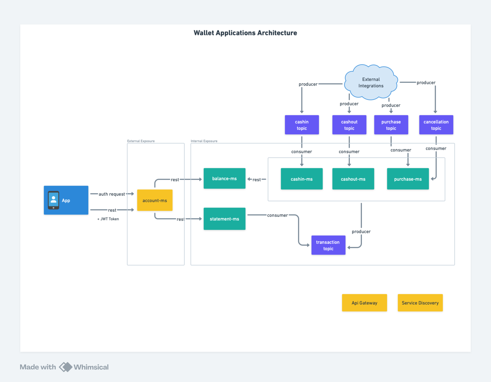

# Teste Wallet #

## Design de Arquitetura ##



Obs.: Os componentes em amarelo não foram implemetados, somente idealizados

## Para executar os Projetos ##

Acesse a raiz do repositório e execute:
```
docker-compose -p wallet up -d
```

## Swagger integrado com endpoints para consulta de saldos e extrato

app-bff: http://localhost:8000/swagger-ui/index.html  

external-mock: http://localhost:8010/swagger-ui/index.html  

## Decisões Arquiteturais

** Uso de Inbox e Outbox Pattern: ** 
Diante do grande volume de eventos vindo de fontes diversas, este padrão foi utilizado para garantir a atomicidade, controle transacional e idempotencia das operações.

** Controle de Duplicidade: **  
Foi considerada a janela de 5 minutos para considerar uma transação duplicada.

